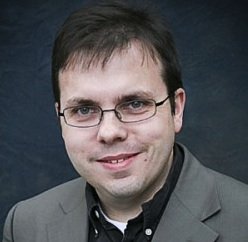

 

Welcome. I am an Associate Professor in the Mathematics Department at [Grand Valley State University](http://www.gvsu.edu) in Allendale, Michigan USA. At this website, you will find information about my teaching, my research and writing projects, and my speaking and consulting work. You can contact me for further information at the links at the bottom of the page. 

### Current courses at GVSU

+ __MTH 201: Calculus__ (Section 03; online) 

### Upcoming speaking engagements

Click here for the full schedule. 

+ __An ABC for Effective Flipped Learning__ (Keynote, Innovation Insights in Quantitative Business; May 25, 2015, Toronto, ON CA)
+ __Implementing and Assessing Flipped Learning in Face-to-Face and Online Contexts__ (Keynote, Hope College Hybrid Learning Workshop; June 8, 2015, Holland MI)
